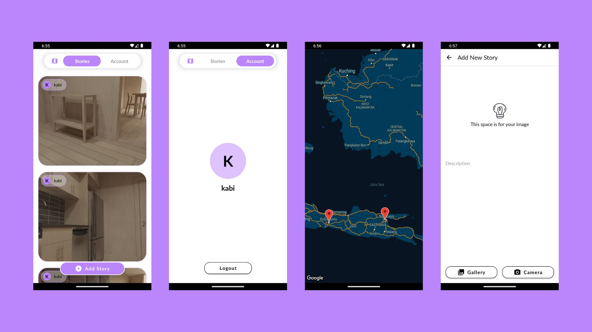

# Stories App

## Overview

**Stories App** demonstrates how to build simple social media app with endless scroll feature 

## Tech Stacks

The app is using : 
- Kotlin
- Architecture Component like Live Data & View Model
- Material Design 3
- Pagination Library
- Retrofit
- Coroutine
- JUnit & Mockito
- Google Map Sevices

